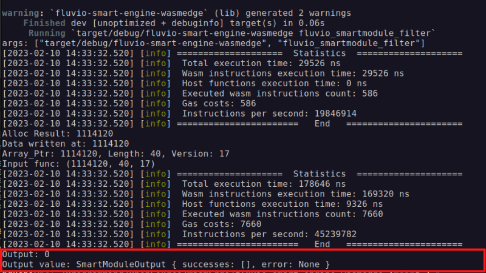

# Fluvio Streaming data processing with WasmEdge 

## What is Fluvio?

Fluvio is an open-source data streaming platform with in-line computation capabilities. It utilizes Wasm to support user-defined compute functions in the data stream. 

## Aim-
To integrate WasmEdge as an alternative runtime for [FluvioSmartEngine](https://github.com/infinyon/fluvio/tree/master/crates/fluvio-smartengine) crate.

## About Wasm file-

* For test, using the fluvio_smartmodule_filter.wasm file. 
* The function filters the data if input text contains `a` in it.
* [Code](https://github.com/infinyon/fluvio/blob/master/smartmodule/examples/filter/src/lib.rs) before compiling the filter function to wasm file.
* The above code file can be converted into wasm file by running `make` command in `fluvio/smartmodule/examples` [directory](https://github.com/infinyon/fluvio/tree/master/smartmodule/examples) in fluvio repository


## Run project-
The repo already contains filter wasm files. 

```rust
    cargo run fluvio_smartmodule_filter 
```

The filter value can be changed by editing array at [Line](https://github.com/Hrushi20/fluvio-smart-engine-wasmedge/blob/main/src/main.rs#L70).
<br><br>
Output when Filter value is apple: 

``` rust
    let input = SmartModuleInput::try_from(vec![Record::new("apple")])?;           // Line 70 main.rs
```


<br>
Output when Filter value is hello world:

``` rust
     let input = SmartModuleInput::try_from(vec![Record::new("hello world")])?;    // Line 70 main.rs 
```



## Statistics- 
The code is configured to generate statistics during execution of wasm functions in wasmedge. 

``` rust

    let stats_config = StatisticsConfigOptions::new().count_instructions(true).measure_cost(true).measure_time(true);
   
    let config = ConfigBuilder::with_statistics_config(ConfigBuilder::default(),stats_config).build()?;

    let mut stats = Statistics::new().expect("Unable to init statistics struct");

    // create an executor
    let mut executor = Executor::new(Some(&config), Some(&mut stats))?;
```


This repository is created as a solution to pretest [LFX Mentorship 2023 01-Mar-May Challenge - for #2231 #2232](https://github.com/WasmEdge/WasmEdge/discussions/2232)
